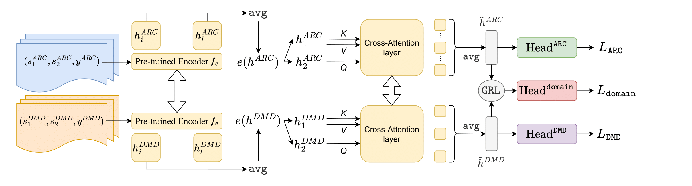

# Disarm


**Disarm** is a RoBERTa based neural system for Argument Relation Classification (ARC). The model leverages discourse markers through adversarial training on the [Discovery](https://github.com/sileod/Discovery) dataset. In particular, Disarm maps into a joint embedding space the argumentative units from the ARC task and sentences from the Discourse Marker Detection task (DMD). This result is achieved through the use of a Gradient Reversal Layer.

This repository holds the code of the paper "Argument Relation Classification through Discourse Markers and Adversarial Training"





## Installation

**Disarm** was tested on Python 3.10.12 using a Google Colab V100 system. It is recommended to set up the model in a virtual environment.

```shell
python -m venv [NAME_OF_ENV]
source [NAME_OF_ENV]/bin/activate

pip install -r requirements.txt
```


## How to run the experiments

Unzip `data.zip`. This will create a new directory `data/` containing the datasets StudentEssay ("student_essay"), Debatepedia ("debate") and M-ARG ("m-arg"). In the following sections, substitute `[NAME_OF_DATASET]` with one of the names in brackets.


#### Run adversarial training on ARC/DMD with grid search

```shell
python main.py --dataset [NAME_OF_DATASET] --adversarial --grid_search
```


#### Run adversarial training on a specific combination of loss weights

```shell
python main.py --dataset [NAME_OF_DATASET] --adversarial --discovery_weight [DISCOVERY_VALUE] --adv_weight [ADV_WEIGHT]
```

with `[DISCOVERY_VALUE]` and `[ADV_WEIGHT]` being scalar values in [0,1].  

To run the tests on Multi-Task Learning (MTL), set the `--adv_weight` to 0.


#### Run RoBERTa+ finetuning

```shell
python main.py --dataset [NAME_OF_DATASET]
```


#### Visualize the embeddings

```shell
python main.py --dataset [NAME_OF_DATASET] --visualize [NAME_OF_DATASET_TO_PLOT]
```

where `[NAME_OF_DATASET_TO_PLOT]` must be either `[NAME_OF_DATASET]` or `discovery`
In order to visualize the embeddings, you must have trained a model on the dataset you want to plot. After training, the best model is saved in a file called `[NAME_OF_DATASET]_model.pt`. The `--visualize` flag forces the program to load the model, calculate the embeddings of the dataset and plot them.
